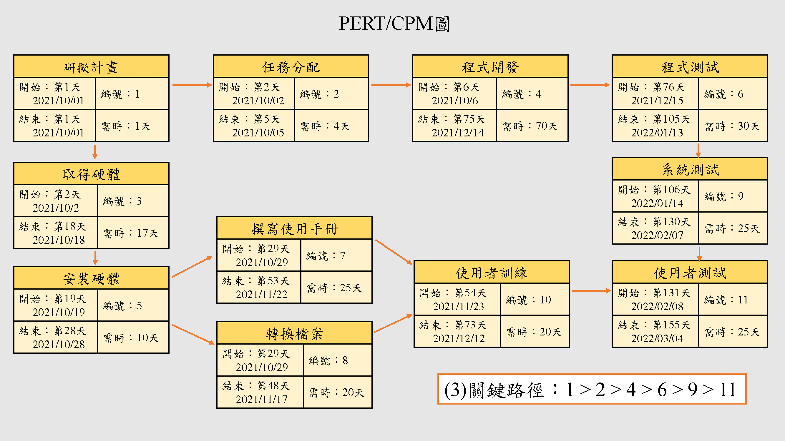
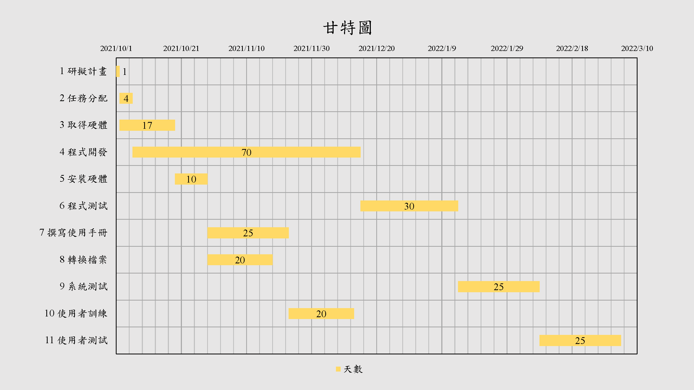

# 20211005_SAD_HW2
### 題目 (圖表皆以2021/10/01為起始日)
|任務|說明|虛實(天)|前置任務|
|:---:|:---:|:---:|:---:|
|**1**|研擬計畫|1|-|
|**2**|任務分配|4|1|
|**3**|取得硬體|17|1|
|**4**|程式開發|70|2|
|**5**|安裝硬體|10|3|
|**6**|程式測試|30|4|
|**7**|撰寫使用手冊|25|5|
|**8**|轉換檔案|30|5|
|**9**|系統測試|25|6|
|**10**|使用者訓練|20|7,8|
|**11**|使用者測試|25|9,10|
***
### (1)PERT/CPM

#
### (2)GANTT

